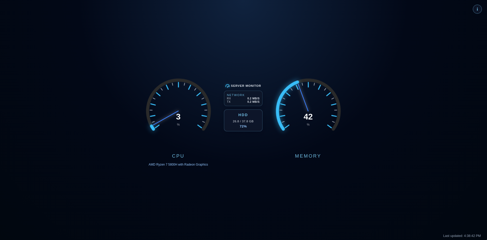

# Server Monitor Dashboard

A real-time system monitoring dashboard built with Python, Flask, psutil, HTML, CSS, and JavaScript.



---

## 🚀 Features

- **Live Metrics** — CPU, memory, disk, and network monitoring through `/metrics`
- **Circular Gauges** — Percentage-based SVG gauges with 5% and 10% tick marks
- **Responsive Layout** — CPU and memory meters with centered network and HDD panels
- **Threshold Alerts** — Red meter states for high CPU, memory, and disk usage
- **Critical State** — Animated red network panel and background when all three thresholds are exceeded
- **Information Modal** — Animated project and author information window

---

## 🛠️ Tech Stack

| Layer | Technology |
|-------|------------|
| Backend | Python, Flask |
| Monitoring | psutil |
| Frontend | HTML5, CSS3, JavaScript |
| Graphics | CSS and inline SVG |

---

## 📦 Prerequisites

- Python 3.8+
- Git

---

## ⚡ Quick Start

### Run with Python

```bash
# Clone the repo
git clone https://github.com/YOUR_USERNAME/server-monitor.git
cd server-monitor

# Install dependencies
pip install -r requirements.txt

# Run the app
python app.py
```

Then open your browser at `http://localhost:5000`

### Run with Docker Compose

```bash
docker compose up --build
```

Then open your browser at `http://localhost:5000`. Stop the service with:

```bash
docker compose down
```

The container serves the app with Gunicorn and includes a health check for `/metrics`.

---

## 📊 API Endpoints

| Endpoint | Method | Description |
|----------|--------|-------------|
| `/` | GET | Dashboard UI |
| `/metrics` | GET | Live system metrics as JSON |

### Sample `/metrics` response:

```json
{
  "timestamp": "2026-04-11T10:00:00",
  "cpu": {
    "usage_percent": 14.9,
    "core_count": 16
  },
  "memory": {
    "total_gb": 15.35,
    "used_gb": 11.19,
    "usage_percent": 72.9
  },
  "disk": {
    "total_gb": 476.01,
    "used_gb": 277.7,
    "usage_percent": 58.3
  },
  "network": {
    "bytes_sent_mb": 56.61,
    "bytes_recv_mb": 2354.4
  }
}
```

---

## Alert Thresholds

| Metric | Default Threshold |
|--------|------------------|
| CPU | > 50% |
| Memory | > 60% |
| Disk | > 80% |

The affected meter or HDD panel turns red when its threshold is exceeded. The network panel and page background enter the animated critical state only when CPU, memory, and disk are all above their thresholds.

---

## Project Structure

server-monitor/

├── agent/

│   └── monitor.py       # System metrics collector

├── static/
│   ├── index.html              # Dashboard UI
│   ├── style.css               # Layout, gauges, alerts, and modal styling
│   ├── script.js               # Metrics updates and interactions
│   └── speed-dial-example.html # Standalone circular gauge prototype

├── Dockerfile                   # Production container image
├── docker-compose.yml           # Local container orchestration
├── .dockerignore                # Docker build exclusions
├── app.py                       # Flask API
└── requirements.txt             # Python dependencies

---

## 👤 Author

**Seyed Fazee Mohamed Afzal**
- [GitHub](https://github.com/Mohamed-Afzal0)
- [LinkedIn](https://www.linkedin.com/in/mohamed-afzal-0b7372305/)
- [Portfolio](https://mohamed-afzal-lovat.vercel.app/)
